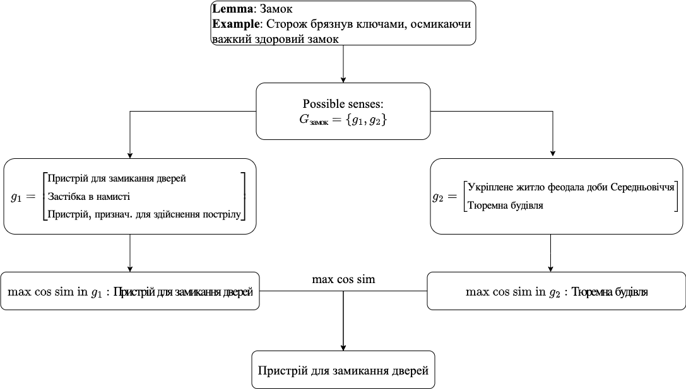

# Contextual embeddings for Ukrainian: A large language model approach to word sense disambiguation


[](https://huggingface.co/lang-uk/ukr-paraphrase-multilingual-mpnet-base)

This repository is an official implementation of paper
[Contextual Embeddings for Ukrainian: A Large Language Model Approach to Word Sense Disambiguation](https://aclanthology.org/2023.unlp-1.2/) (Laba et al., UNLP 2023 at EACL).

## WSD task overview
Word Sense Disambiguation (WSD) task involves identifying a polysemic word’s correct meaning in a given context.

## Solution overview

In our approach to the Word Sense Disambiguation (WSD) task, we fine-tuned the **ConEFU** model for the Ukrainian language. **ConEFU** is based on the [S-BERT model](https://huggingface.co/sentence-transformers/paraphrase-multilingual-mpnet-base-v2) and was fine-tuned using an unsupervised triplet dataset built on [UberText2.0](https://lang.org.ua/en/ubertext/). We employed TripletMarginLoss during fine-tuning to maximize the separation between correct and incorrect senses of homonyms.

The model was validated on a WSD dataset based on the [СЛОВНИК УКРАЇНСЬКОЇ МОВИ](https://sum20ua.com). To the best of our knowledge, this is the first dataset used to validate the WSD task in Ukrainian.

**ConEFU** can be utilized to generate high-quality embeddings for the Ukrainian language. It is available on [Hugging Face](https://huggingface.co/sentence-transformers/paraphrase-multilingual-mpnet-base-v2).


## Metrics
## Metrics
| Model                          | Overall Acc. | Noun Acc. | Verb Acc. | Adj. Acc. | Adv. Acc. |
|--------------------------------|--------------|-----------|-----------|-----------|-----------|
| Babelfy Baseline               | 0.526        | -         | -         | -         | -         |
| PMMBv2                         | 0.735        | 0.767     | 0.668     | 0.752     | 0.593     |
| ConEFU ∼190K Triplets          | 0.770        | 0.819     | 0.685     | 0.743     | 0.562     |
| ConEFU ∼1.2M Triplets          | 0.778        | **0.825** | **0.698** | **0.761** | 0.531     |
| ConEFU ∼1.2M Triplets Filtered* | **0.779** | 0.824     | 0.693     | 0.759     | **0.607** |

(**\***) Filtering refers to removing triplets where the difference between the cosine similarity of the anchor and positive examples, and the anchor and negative examples, is less than 0.3.

## Datasets

### The WSD evaluation dataset

- **Lemma**: The base form of the word.
- **Lexical Meanings**: List of distinct meanings associated with the lemma.
- **Usage Examples**: Sentences demonstrating how each meaning is used in context.

| Lemma | Lexical Meanings | Usage Examples |
|-------|-------|----------|
| коса  | ['Заплетене волосся', 'Довге волосся'] | ['Якраз під старою вишнею стояла дівчина, хороша, як зоря ясна; руса коса нижче пояса', 'Очі в неї були великі, дві чорні коси, перекинуті наперед, обрамляли лице'] |
| коса  | ["Сільськогосподарське знаряддя для косіння трави, зернових, що має форму вузького зігнутого леза, прикріпленого до кісся дерев'яного держака"] | ['Свідок слави, дідівщини З вітром розмовляє, А внук косу несе в росу, За ними співає', 'Косарі косять, А вітер повіває, Шовкова трава На коси полягає'] |
| коса  | ['Піщана вузька, довга частина суходолу, що відокремлює від відкритого моря бухту, озеро або затоку; мис'] | ['Човен повернув за гострий ріг піскуватої коси і вступив у Чорне море', 'Скільки оком скинеш – леліє Дніпро, вигинаючись помежи горами, тихо миючи піскуваті коси'] |
| коса  | ['Селезінка'] | ['Коса свиняча, що коло печінки, довгенька'] |
| коса  | ['Південноафриканський етнос, що належить до групи народів банту'] | ['За генеалогічними переказами, коса є нащадками легендарного вождя Коса, від імені якого й походить назва етносу', 'У 1886 році британський дослідник Георг Тіль видав збірку казок і байок коса'] |

You can access the WSD evaluation dataset [here](placeholder) or generate it on your own using U-WSD framework:

```python
from src.utils_data import read_and_transform_data

data = read_and_transform_data('sum_14_final.jsonlines', homonym=True)
```

### The WSD train dataset

- **Anchor**: A sentence containing the target homonym lemma in its specific meaning.
- **Positive**: A sentence containing the target homonym lemma with the same meaning as the anchor.
- **Negative**: A sentence containing the target homonym lemma with a different meaning from the anchor.
- **Positive Score**: Cosine similarity score between the anchor and the positive sentence.
- **Negative Score**: Cosine similarity score between the anchor and the negative sentence.


| Anchor                                                                                                     | Positive                                                      | Negative                                                                                                   | Positive Score | Negative Score |
|------------------------------------------------------------------------------------------------------------|---------------------------------------------------------------|------------------------------------------------------------------------------------------------------------|----------------|----------------|
| Як наслідок - Бердянська <ins>**коса**</ins> у розпал курортного сезону залишилася взагалі без питної води".            | Вода чиста, піщана <ins>**коса**</ins> досить далеко заходить у море.       | Батько, який помер, коли Міріам було 6 років, належав до народу <ins>**коса**</ins>.                                     | 0.712      | 0.351     |
| Аграрії прийшли до Азарова з вилами і <ins>**косами**</ins> Близько півтори тисячі аграріїв пікетували Кабінет міністрів.  | Половина війська була озброєна вилами, <ins>**косами**</ins> і сокирами.     | На <ins>**косі**</ins>, окрім краєвидів, моря й пляжів, можна також захоплююче порибалити.                                | 0.628      | 0.324     |
| Саме в цій версії у Лари Крофт з'являється <ins>**коса**</ins>.                                                          | Але ось з'явилася дівчинка з <ins>**косою**</ins> на голові.                | Зовнішні Північно-Фризькі піщані <ins>**коси**</ins>  Япзанд  Нордероогзанд  Зюдероогзанд  Кніпзанд  Юнгнамензанд          | 0.773      | 0.385       |

Training dataset is being generated in unsupervised way. To generate it on your own run the following scripts:
```bash
python3 collect_ubertext_sentences.py
python3 collect_triplets.py
```
The dataset used in our paper is available for access [here](https://drive.google.com/drive/folders/1uY3nOYba-1fVpe_7s_Vj8P9MNawukuw-?usp=sharing).


## How to reproduce the results
### Step 1: Preparation
1. run collect_ubertext_senteces.py - will generate lemma -> sentences that contain that lemma

2. run collect_triplets.py - generate triplets

3. process sum (main.py)

### Step 2: Train
4. run run_fine_tuning.py

### Step 3: Evaluation

*Figure 1: Evaluation strategy visualization.*

5. run word sence predictor (main.py)

## Citation

```
@inproceedings{laba-etal-2023-contextual,
    title = "Contextual Embeddings for {U}krainian: A Large Language Model Approach to Word Sense Disambiguation",
    author = "Laba, Yurii  and
      Mudryi, Volodymyr  and
      Chaplynskyi, Dmytro  and
      Romanyshyn, Mariana  and
      Dobosevych, Oles",
    editor = "Romanyshyn, Mariana",
    booktitle = "Proceedings of the Second Ukrainian Natural Language Processing Workshop (UNLP)",
    month = may,
    year = "2023",
    address = "Dubrovnik, Croatia",
    publisher = "Association for Computational Linguistics",
    url = "https://aclanthology.org/2023.unlp-1.2",
    doi = "10.18653/v1/2023.unlp-1.2",
    pages = "11--19"
}
```


TODOs:
1. Publish paper on papers with code
2. Publish WSD eval dataset and link it
  - Generate WSD Eval dataset
3. Go through the code, do high priority refactoring (like in src folder), create main scripts (main train, prepare and eval. Maiby in separate module)
  - check fine_tune_pytorch and remove it
4. Add brief documentation to each class/function
5. Improve project structure (like badly_predicted.py)
6. Fix train seeds
7. Generate new datasets (triplets and wsd_eval) and fine tune model
8. Check number of sentences collected per lemma
